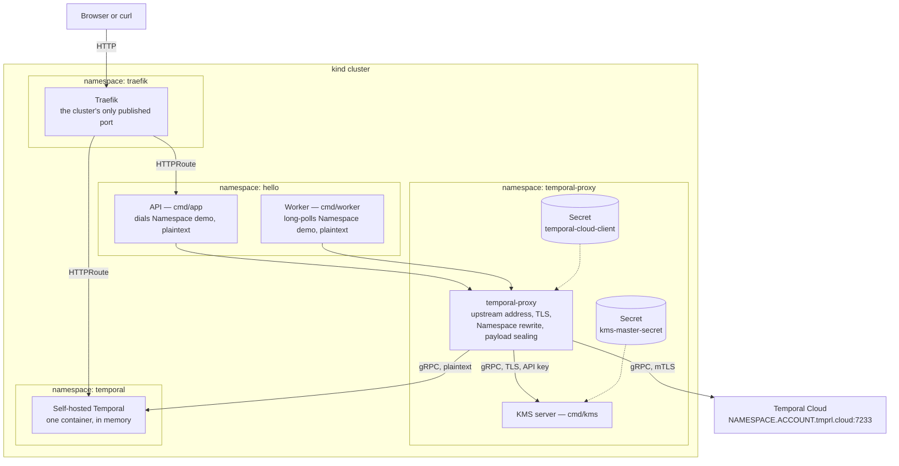

# Temporal Proxy Demo

[![CI][ci-badge]][ci]
[](LICENSE)

Runs Temporal Workers that know nothing about the
[Temporal Service][temporal] they talk to. [temporal-proxy][proxy] sits
in front of them and owns the upstream address, TLS, the client
certificate and the Namespace names, so the Worker and the API carry no
upstream connection, TLS, credential or Namespace configuration of their
own.

Connection details are only the first thing it takes over. Payload
encryption is another: temporal-proxy seals every payload before it
leaves the cluster and unseals it on the way back, so the Worker and
the API send plain payloads and hold no key material either. That
happens in the proxy, below whichever SDK a Worker is written with —
this demo uses Go, and nothing about it is specific to Go.

https://github.com/user-attachments/assets/a35beca7-2195-40da-917f-2e213daa0cd6

The whole demo runs on a local Kubernetes cluster: Traefik publishes the
API, and temporal-proxy is the only workload that knows where Temporal
is. That cluster also holds a self-hosted Temporal Service, a second
upstream the Worker and the API can be routed at without a line of
either of them changing.

## Architecture



Solid arrows carry traffic, dotted ones are Secrets mounted into a Pod.
Both arrows into temporal-proxy leave the application: the Worker's is a
long poll on its Task Queue, so a Workflow reaches the Worker over a
connection the Worker itself opened, and nothing outside the cluster
ever dials in. Only Traefik's web entrypoint is published — the two
arrows that cross the cluster boundary are the browser's and
temporal-proxy's.

temporal-proxy has two upstreams and forwards to one of them. Temporal
Cloud is the one the demo ships routed at; the self-hosted Service sits
there until the configuration says otherwise, which is
[the scenario below](#routing-at-another-temporal-service).

## Prerequisites

- Docker — builds the image, and runs the cluster's nodes. Podman also
  works: run `make` with `CONTAINER_TOOL=podman`, and `kind` picks
  Podman up by itself unless a `docker` CLI is also on `PATH`
- [kind][kind] — the local Kubernetes cluster
- `kubectl` and [Helm][helm] 3.16+ — Traefik, cert-manager and
  temporal-proxy all come from their upstream charts, each pinned to an
  explicit version
- Go 1.27 or later
- A Temporal Cloud Namespace whose accepted client CA signed the
  certificate in `k8s/certs/`

The image is built locally and loaded straight into the cluster's nodes,
so there is no registry and nothing to push.

### Generating the client certificate

Temporal Cloud authenticates temporal-proxy with mTLS, so it needs a
client certificate signed by a CA the Namespace accepts.
[`tcld`][tcld] generates both halves. Keep the CA outside this
repository — only the client pair belongs in `k8s/certs/`:

```bash
tcld generate-certificates certificate-authority-certificate \
  --organization "my-org" \
  --validity-period 365d \
  --ca-certificate-file ca.pem \
  --ca-key-file ca.key

tcld generate-certificates end-entity-certificate \
  --organization "my-org" \
  --ca-certificate-file ca.pem \
  --ca-key-file ca.key \
  --certificate-file k8s/certs/client.pem \
  --key-file k8s/certs/client.key
```

Then register the CA on the Namespace, so Cloud accepts certificates it
signed. `--namespace` takes the fully-qualified name, and the command
talks to Cloud, so authenticate first:

```bash
tcld login
tcld namespace accepted-client-ca add \
  --namespace "quickstart.a1b2c" \
  --ca-certificate-file ca.pem
```

`k8s/certs/` is git-ignored apart from its `.gitkeep`, so the client
pair stays out of version control. `make` reads the two files from there
to build the Secret temporal-proxy mounts. See [Authenticate with mTLS
certificates][mtls] for the Cloud side.

## Quick start

Copy the environment template and fill in the two Temporal Cloud
values — the short Namespace name and the account id, the two halves of
a fully-qualified Cloud Namespace (`quickstart.a1b2c` is `quickstart`
plus `a1b2c`) — then generate the payload key's master secret:

```bash
cp .env.example .env
echo "KMS_MASTER_SECRET=$(openssl rand -base64 32)" >> .env
```

Put the client certificate in `k8s/certs/` as `client.pem` and
`client.key`, then bring the demo up and trigger a Workflow:

```bash
make app-up
make demo
```

```json
{"greeting":"Hello, John Doe!","workflowId":"hello-x4t7…","runId":"01a0…"}
```

`make app-up` creates the cluster, installs everything in it and waits
for the rollout. The answer takes about two seconds — the Activity
sleeps, so there is time to watch the Execution in the Cloud Web UI.
`make endpoints` prints the addresses, and `make demo NAME=Alex` greets
someone else.

`make demo` is not the only way in. The API also serves a page at that
same published address, the one `make endpoints` prints: one button
starts an Execution, and the request is drawn travelling through the
stack and back while it runs, so a Workflow is watched from a browser
rather than read off a JSON line. Both go through the same endpoint.

On a cluster that has just been created, Traefik loads a new route a
moment after the rollout finishes, so the very first `make demo` can
answer `503`. Run it again.

Run `make` to list every target. `make app-down` removes the Worker and
the API and leaves the cluster, Traefik, temporal-proxy, the KMS server
and the self-hosted Temporal Service standing, so `make app-up` puts the
demo back without rebuilding any of that; `make cluster-down` deletes
everything.

## What runs where

| Namespace        | What it holds                                          |
| ---------------- | ------------------------------------------------------ |
| `traefik`        | Traefik and its Gateway, the cluster's only port       |
| `temporal-proxy` | temporal-proxy and the KMS server, plus what they read |
| `temporal`       | The self-hosted Temporal Service, the second upstream  |
| `hello`          | The Worker and the API, with Service and route         |

`make cluster-up` also creates a `cert-manager` and a
`secretgen-controller` namespace, for the two controllers that issue the
KMS server's certificate and generate its bearer token.

Traefik's web entrypoint is the single published port, and the two
routes behind it are the API and the self-hosted Web UI. Everything else
is reachable only from inside the cluster, temporal-proxy included.

Traefik, cert-manager and temporal-proxy come from their upstream Helm
charts, each pinned to an explicit version, with the values this demo
needs in `k8s/charts/`. The Worker and the API come from the manifests
under `k8s/app`, and the self-hosted Temporal Service from
`k8s/temporal`, both applied with Kustomize.

## How the certificate travels

The certificate never appears in a manifest. `make apply` reads it from
the working directory and builds the Secret the chart mounts:

```text
k8s/certs/client.pem + client.key
  → Secret temporal-cloud-client (keys tls.crt and tls.key)
  → the upstream's tls.secretName in k8s/charts/temporal-proxy.yaml
  → mounted by the chart at /etc/temporal-proxy/certs/upstream-cloud
  → the cert and key paths in the rendered configuration
```

What the chart mounts is an ordinary Kubernetes Secret, and nothing
assumes where that Secret came from. `make` fills it here so the demo
stays self-contained, but whatever else populates a Secret works just
as well — the Vault Secrets Operator, the External Secrets Operator
syncing from a cloud secret manager, a sealed-secret controller — and
`tls.secretName` is the only line that has to agree with it.

## How the payload key travels

Nothing seals a payload with a key from a file. temporal-proxy generates
a data encryption key, seals payloads with it, and asks the KMS server
to wrap that key:

```text
KMS_MASTER_SECRET in .env
  → Secret kms-master-secret
  → the KMS server, which derives one AES-256-GCM key per Namespace
  → wraps each data encryption key temporal-proxy sends it
  → the wrapped key travels inside the sealed payload
```

The KMS server derives its key from the short Namespace name the
application asked for — `demo` — never the fully-qualified Cloud name.

Turning encryption off is one flag, `encryption.enabled`, plus
`make apply`. Payloads sealed earlier stay readable, which is why the
flag rather than the whole block is what turns encryption off.

## Routing at another Temporal Service

Temporal Cloud is not the only upstream in the cluster. A self-hosted
Temporal Service runs beside it, in the `temporal` namespace: one
container, everything in memory, nothing persisted, with the `demo`
Namespace created at startup. It is there to answer a question the
Worker has no way to ask — which Temporal Service is serving it.

Both upstreams are declared in `k8s/charts/temporal-proxy.yaml`, and
one line picks between them. An upstream nothing routes to is never
dialled, so switching is a single word:

```yaml
config:
  routing:
    default: cloud   # write `selfhosted` here instead
  upstreams:
    - name: cloud
      hostPort: ${TEMPORAL_CLOUD_NAMESPACE}.${TEMPORAL_ACCOUNT}.tmprl.cloud:7233
      # ... TLS, the client certificate, the Namespace rewrite
    - name: selfhosted
      hostPort: temporal.temporal:7233
```

```bash
make apply
make demo
```

`make apply` still runs its setup guard, so the Temporal Cloud values and
the client certificate are required even when the Workers are routed at
the self-hosted Service.

`routing.system` is absent on purpose. Left unset, it hands the
requests that carry no Namespace — the `GetSystemInfo` a Client sends on
connect, among others — to `routing.default` as well, so there is only
ever one name to change.

The second upstream is two lines, and what it leaves out is the point.
No `tls` block, because the endpoint is dialled in plaintext inside the
cluster. No `namespaces.rules`, because that Service registers the
Namespace under `demo` — the very name the application asks for — so
there is nothing to rewrite, where Cloud knows it as
`NAMESPACE.ACCOUNT`.

Nothing else moves. The image is not rebuilt, the Worker and the API are
neither restarted nor reconfigured, and they still hold the same two
variables: `temporal-proxy.temporal-proxy:7233` and `demo`. The page
they serve is unchanged too, because it never named an upstream in the
first place.

`make endpoints` prints the self-hosted Web UI, published on the same
single Traefik port as the demo. Run `make demo` on either side of the
switch and the two Executions land in different Temporal Services — the
first in the Cloud Namespace, the second in this one.

Payload encryption is not part of the switch. temporal-proxy seals every
payload whichever upstream it forwards to, so the self-hosted Web UI
shows sealed payloads exactly as the Cloud one does: the Temporal
Service on the far end is never the one holding the key.

The self-hosted Service keeps nothing. It starts empty, and a restart
takes the history with it — which is what makes it disposable, and why
Temporal Cloud is the upstream the demo ships routed at. Write `cloud`
back and run `make apply` to return.

One upstream at a time is only the simplest case: `routing.rules`
matches on the Namespace a request asks for, so a single temporal-proxy
can serve `demo` from the self-hosted Service and another application's
Namespace from Cloud, with neither application aware of the split.

## What the application does not carry

The Worker and the API each get the same two environment variables, and
neither describes an upstream:

| Variable             | Value                                |
| -------------------- | ------------------------------------ |
| `TEMPORAL_ADDRESS`   | `temporal-proxy.temporal-proxy:7233` |
| `TEMPORAL_NAMESPACE` | `demo`                               |

Those two are a cluster-local address, dialled in plaintext, and a short
Namespace name. Nothing else is needed because everything else lives in
temporal-proxy's configuration: the Cloud host name, the TLS material,
and the rewrite from `demo` to the fully-qualified Cloud Namespace.
`TEMPORAL_NAMESPACE` says which Namespace the application asks for, not
which upstream serves it — picking an upstream is not something the
application can do.

The page renders only the short Namespace name and names no upstream at
all — naming one is precisely what the application cannot do.

The short name is `demo` rather than `default` because one
temporal-proxy fronts several applications, so the name each one asks
for has to identify it. Both variables also have fallbacks in the code —
`localhost:7233` and `default`, what a `temporal server start-dev`
serves — so the binaries run unchanged outside the cluster.

## License

This project is licensed under the Apache-2.0 License — see
[LICENSE](LICENSE) for details.

temporal-proxy itself is a separate project, licensed under MIT.

[ci]: https://github.com/alexandreroman/temporal-proxy-demo/actions/workflows/ci.yaml
[ci-badge]: https://github.com/alexandreroman/temporal-proxy-demo/actions/workflows/ci.yaml/badge.svg
[temporal]: https://temporal.io
[proxy]: https://github.com/temporalio/temporal-proxy
[kind]: https://kind.sigs.k8s.io
[helm]: https://helm.sh
[mtls]: https://docs.temporal.io/cloud/certificates
[tcld]: https://docs.temporal.io/cloud/tcld
