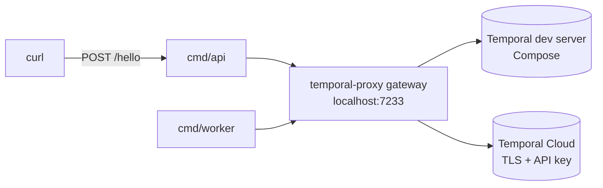

# temporal-proxy-demo

Runs Temporal Workers that know nothing about the Temporal Service they
talk to. [temporal-proxy][proxy] sits in front of them and owns the
upstream address, TLS, credentials, Namespace names, and payload
encryption — so moving a Worker from a local dev server to Temporal
Cloud is a configuration change, not a code change.

[](LICENSE)

> [!NOTE]
>
> The local scenario runs end to end today. The Temporal Cloud and
> payload encryption scenarios are described below but their proxy
> configurations are not written yet.

## Features

- **Zero connection config in the app** — the Worker and the API dial
  `localhost:7233` in plaintext with a short Namespace name, and nothing
  else. No TLS material, no API key, no upstream host name.
- **Trigger a Workflow over HTTP** — `POST /hello` starts one
  `hello-workflow` Execution and returns its result.
- **Multi-upstream routing** — one local endpoint fans out to several
  upstreams, chosen per request by Namespace.
- **Temporal Cloud without the ceremony** — the proxy attaches TLS, the
  API key, and the Namespace rewrite on the way out.
- **Payload encryption** — envelope encryption on the hop to the
  upstream, so the Temporal Service only ever stores ciphertext while the
  app keeps exchanging cleartext.

## Prerequisites

- Docker (or Podman) with Compose v2
- Go 1.27 or later — for `make dev`, which runs the Worker and the
  API on the host
- A Temporal Cloud Namespace with API key authentication enabled, for
  the Cloud scenario only. See [API keys][api-keys].

## Getting Started

Bring up the Temporal dev server and the proxy, then run the app:

```bash
git clone <this-repository>
cd temporal-proxy-demo
make dev
```

`make dev` starts the Compose stack, then the Worker and the HTTP API on
the host. In another terminal, trigger a Workflow:

```bash
make demo
```

```text
Hello, Temporal!
```

The response takes about two seconds — the Activity sleeps, so you can
watch the Execution progress in the Temporal Web UI at
<http://localhost:8233>.

Run `make` to list every target.

## Usage

`make demo` is a `curl` on the API. Override who gets greeted, or the
port the API listens on:

```bash
make demo NAME=Alex
curl -fsS -X POST "http://localhost:8080/hello?name=Alex"
```

Stop everything with Ctrl-C, then tear the stack down:

```bash
make infra-down
```

The Worker and the API can also run in containers, next to the dev
server and the proxy. `make app-up` builds the image and starts the
whole stack; `make demo` works the same way against it:

```bash
make app-up
make demo
make app-down
```

## Configuration

The app reads three variables, none of which describe an upstream:

| Variable             | Description                        | Default          |
| -------------------- | ---------------------------------- | ---------------- |
| `TEMPORAL_ADDRESS`   | Proxy gateway the app dials        | `localhost:7233` |
| `TEMPORAL_NAMESPACE` | Short, local Namespace name        | `default`        |
| `PORT`               | HTTP listen port for the API       | `8080`           |

The proxy is configured by [`proxy/config.yaml`](proxy/config.yaml),
mounted read-only into its container. The base configuration declares a
single upstream — the Compose dev server — and routes everything to it.

Credentials for the Temporal Cloud scenario live in `.env`, which is
git-ignored. Copy [`.env.example`](.env.example) to get started.

## Architecture

The Worker and the API only ever see the gateway. Which upstream a
request reaches is decided by the proxy, from the Namespace on the
request.



| Module                    | Description                                    |
| ------------------------- | ---------------------------------------------- |
| `cmd/worker`              | Temporal Worker, polling through the proxy     |
| `cmd/api`                 | HTTP API that starts one Workflow Execution    |
| `internal/hello`          | The hello-workflow Workflow and its Activity   |
| `internal/temporalclient` | Shared client: plaintext, no credentials       |
| `proxy`                   | temporal-proxy configuration, one per scenario |
| `Dockerfile`              | One image carrying both binaries               |

## License

This project is licensed under the Apache-2.0 License — see
[LICENSE](LICENSE) for details.

temporal-proxy itself is a separate project, licensed under MIT.

[proxy]: https://github.com/temporalio/temporal-proxy
[api-keys]: https://docs.temporal.io/cloud/api-keys
