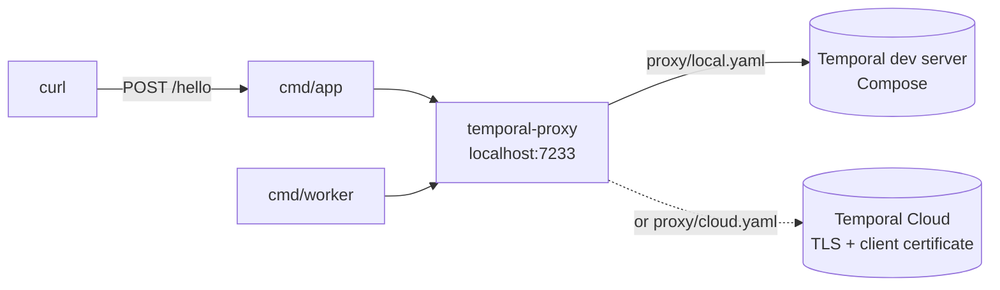

# Temporal Proxy Demo

Runs Temporal Workers that know nothing about the Temporal Service they
talk to. [temporal-proxy][proxy] sits in front of them and owns the
upstream address, TLS, credentials, Namespace names, and payload
encryption — so moving a Worker from a local dev server to Temporal
Cloud is a configuration change, not a code change.

[](LICENSE)

> [!NOTE]
>
> The local and the Temporal Cloud scenarios both ship as proxy
> configurations you can switch between. Payload encryption is
> described below but is not implemented yet.

## Features

- **Zero connection config in the app** — the Worker and the API dial
  `localhost:7233` in plaintext with a short Namespace name, and nothing
  else. No TLS material, no client certificate, no upstream host name.
- **Trigger a Workflow over HTTP** — `POST /hello` with
  `{"name": "Ada"}` starts one `hello-workflow` Execution, identified as
  `hello-<UUID>`, and answers `{"greeting": "Hello, Ada!"}`.
- **Switch upstreams by configuration** — one committed config file per
  scenario, one upstream active at a time. `make use-cloud` and
  `make use-local` swap which file temporal-proxy runs with; no Go code
  changes and no image is rebuilt.
- **Temporal Cloud without the ceremony** — the proxy attaches TLS, the
  client certificate, and the Namespace rewrite on the way out.
- **Payload encryption** — envelope encryption on the hop to the
  upstream, so the Temporal Service only ever stores ciphertext while the
  app keeps exchanging cleartext.

## Prerequisites

- Docker (or Podman) with Compose v2
- Go 1.27 or later — for `make dev`, which runs the Worker and the
  API on the host
- A Temporal Cloud Namespace whose accepted client CA signed the
  certificate temporal-proxy presents, for the Cloud scenario only.
  See [Authenticate with mTLS certificates][mtls].

## Getting Started

Bring up the Temporal dev server and the proxy, then run the app:

```bash
git clone <this-repository>
cd temporal-proxy-demo
make dev
```

`make dev` starts the Compose stack, then the Worker and the HTTP API on
the host. In another terminal, trigger a Workflow:

```bash
make demo
```

```json
{"greeting":"Hello, Temporal!"}
```

The response takes about two seconds — the Activity sleeps, so you can
watch the Execution progress in the Temporal Web UI at
<http://localhost:8233>.

Run `make` to list every target.

## Usage

`make demo` is a `curl` on the API. Override who gets greeted, or the
port the API listens on:

```bash
make demo NAME=Alex
curl -fsS -X POST http://localhost:8080/hello \
  -H 'Content-Type: application/json' \
  -d '{"name": "Alex"}'
```

Stop everything with Ctrl-C, then tear the stack down:

```bash
make infra-down
```

The Worker and the API can also run in containers, next to the dev
server and the proxy. `make app-up` builds the image and starts the
whole stack; `make demo` works the same way against it:

```bash
make app-up
make demo
make app-down
```

## Switching upstreams

Moving the whole demo from the local dev server to Temporal Cloud is a
change of proxy configuration and nothing else — no Go code touched, no
image rebuilt:

```bash
make use-cloud
make demo
make use-local
```

`make use-cloud` refuses unless `TEMPORAL_CLOUD_NAMESPACE` and
`TEMPORAL_ACCOUNT` are set in `.env` and both `proxy/certs/client.pem`
and `proxy/certs/client.key` exist, and it names everything that is
missing. The check is deliberate: temporal-proxy validates all of it
on startup, so an incomplete setup would leave it crash-looping with
the reason buried in its log.

Both targets record the choice in `.env`, apply it, and print the
scenario they selected, so the new upstream is live straight away. The
switch starts temporal-proxy if it is down rather than deferring the
choice. `make scenario` prints the active one.

Applying it means recreating temporal-proxy and restarting the Worker
and the API, so nothing keeps polling the upstream that was just left
behind. The command comes back in about six seconds and `make demo`
answers right after: some nine seconds from typing the switch to reading
a greeting, two and a half of which are the hello Workflow's own
Activity. A request fired in the very same instant can still be refused
while the API binds its port again — retry once.

Two things the switch does not do:

- **It changes the destination, not the history.** Workflow Executions
  started against the dev server stay on the dev server; they do not
  appear in Cloud.
- **It does not stop the dev server.** The dev server remains a Compose
  dependency of temporal-proxy, so in the cloud scenario the local Web
  UI is still up — and empty. That is why `make endpoints` links the
  Cloud Web UI instead while that scenario is active.

### Generating the client certificate

Temporal Cloud authenticates temporal-proxy with mTLS, so it needs a
client certificate signed by a CA the Namespace accepts. [`tcld`][tcld]
generates both halves. Keep the CA outside this repository — only the
client pair belongs in `proxy/certs/`:

```bash
tcld generate-certificates certificate-authority-certificate \
  --organization "my-org" \
  --validity-period 365d \
  --ca-certificate-file ca.pem \
  --ca-key-file ca.key

tcld generate-certificates end-entity-certificate \
  --organization "my-org" \
  --ca-certificate-file ca.pem \
  --ca-key-file ca.key \
  --certificate-file proxy/certs/client.pem \
  --key-file proxy/certs/client.key
```

Then register the CA on the Namespace, so Cloud accepts certificates it
signed. `--namespace` takes the fully-qualified name, and the command
talks to Cloud, so authenticate first:

```bash
tcld login
tcld namespace accepted-client-ca add \
  --namespace "quickstart.a1b2c" \
  --ca-certificate-file ca.pem
```

`proxy/certs/` is git-ignored apart from its `.gitkeep`, so the client
pair stays out of version control. Only temporal-proxy mounts it.

### What actually differs

The two configuration files are the whole story. Each opens with a
header comment explaining its own scenario, which makes the raw
`diff proxy/local.yaml proxy/cloud.yaml` noisier than the substance;
filtering them out shows how little there is to it:

```bash
diff <(grep -v '^#' proxy/local.yaml) <(grep -v '^#' proxy/cloud.yaml)
```

What differs is the `upstreams` block, plus the upstream's name in
`routing`. Everything Temporal Cloud needs lives in that block, and the
application sees none of it: TLS, the client certificate temporal-proxy
presents, and the rewrite from the short Namespace name `default` to
the fully-qualified Cloud one.

## Configuration

Two sets of variables that never meet. The app reads three, none of
which describe an upstream:

| Variable             | Description                     | Default          |
| -------------------- | ------------------------------- | ---------------- |
| `TEMPORAL_ADDRESS`   | Local endpoint the app dials    | `localhost:7233` |
| `TEMPORAL_NAMESPACE` | Short, local Namespace name     | `default`        |
| `PORT`               | HTTP listen port for the API    | `8080`           |

`TEMPORAL_NAMESPACE` is `default` in every scenario, and
[`compose.yaml`](compose.yaml) pins that literal on the Worker and the
API. It says which Namespace the app asks for, not which upstream serves
it: picking an upstream is not something the app can do.

The second set belongs to temporal-proxy, and comes from `.env`:

| Variable                   | Description                     | Scenario |
| -------------------------- | ------------------------------- | -------- |
| `PROXY_CONFIG`             | Config file Compose mounts      | all      |
| `TEMPORAL_CLOUD_NAMESPACE` | Cloud Namespace, short name     | cloud    |
| `TEMPORAL_ACCOUNT`         | Cloud account id                | cloud    |

`PROXY_CONFIG` defaults to [`proxy/local.yaml`](proxy/local.yaml); the
Cloud twin is [`proxy/cloud.yaml`](proxy/cloud.yaml). The short Namespace
name and the account id are the two halves of a fully-qualified Cloud
Namespace: `quickstart.a1b2c` is `quickstart` plus `a1b2c`.

Only temporal-proxy is given anything Cloud-specific — `compose.yaml`
passes the two Namespace values, and mounts `proxy/certs/` read-only,
on the `temporal-proxy` service and on no other. The Worker and the API
get `TEMPORAL_ADDRESS` and `TEMPORAL_NAMESPACE`, and that is the whole
of what they know. That asymmetry is the point of the demo.

The scenario lives in `.env` because `.env` is the one file
`docker compose` reads on its own: a bare `docker compose up` then runs
the same scenario as any `make` target. `.env` is git-ignored — copy
[`.env.example`](.env.example) to get started.

## Architecture

The Worker and the API only ever see temporal-proxy. Exactly one upstream
is active at a time, and the configuration file it runs with is what
decides which.



| Module                    | Description                                    |
| ------------------------- | ---------------------------------------------- |
| `cmd/worker`              | Temporal Worker, polling through the proxy     |
| `cmd/app`                 | HTTP API that starts one Workflow Execution    |
| `internal/hello`          | The hello-workflow Workflow and its Activity   |
| `internal/temporalclient` | Shared client: plaintext, no credentials       |
| `proxy`                   | temporal-proxy configuration, one per scenario |
| `Dockerfile`              | One image carrying both binaries               |

## License

This project is licensed under the Apache-2.0 License — see
[LICENSE](LICENSE) for details.

temporal-proxy itself is a separate project, licensed under MIT.

[proxy]: https://github.com/temporalio/temporal-proxy
[mtls]: https://docs.temporal.io/cloud/certificates
[tcld]: https://docs.temporal.io/cloud/tcld
